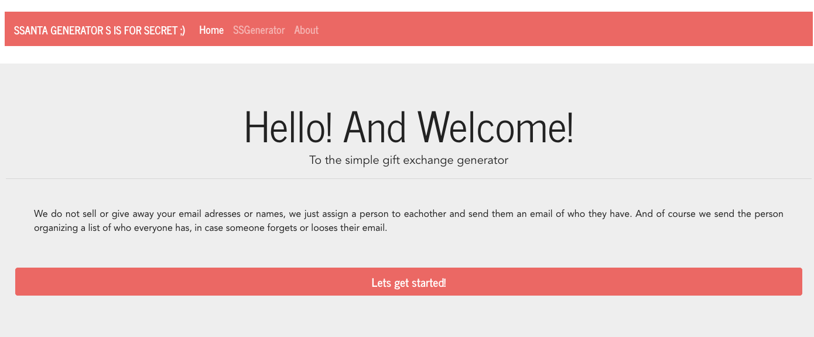

# SSanta Generator

Before the Christmas of 2018, I was looking for a Secret Santa Generator and each one I found wanted me to create an account. Once you created an each person in your list had to sign up for a group and make an account. Then once everyone signed up, It made you draw names together. As you can tell that was too much work, I just wanted to send a few emails with someones Santa and receiver. Plus Im pretty sure they sold my info fund their service. So I decided to create a my own Secret Santa. One that just took in a bunch names, randomly paired everyone up and just sends them a message. No registrations, no creepy Facebook ads. Simple and right to the point. Have a great Gift Exchange!

## How It Works
SSanta Generator allows users to create a gift exchange group with options. You Start out setting the gift value limit and whether or not to allow the organizer to have a copy of the gift exchange pairs. Once you enter all the names and their emails you check it over once and SSanta sends "Santa" in the group their gift recipient.
###SSanta Splash

<!-- need to add Gif or Video of SSAnta -->

## Links
Coming Soon.
<!-- need to deploy -->

## To Run SSanta your self
1. Fork, Clone or Download repo
2. run ```npm init``` on the client side and server side.
3. make sure to change the cors and api calls to the localhost ports before starting the server and client side.
4. run ```npm start``` on the server side to start running the server localy
5. run ```npm run serve``` on the client side to start runnig the front end.

## Technology

SSanta Generator is built using [Vue.js](https://vuejs.org/), [VueX](https://vuex.vuejs.org/), [Vue-Router](https://router.vuejs.org/), [vue-map-fields](https://github.com/maoberlehner/vuex-map-fields) package, and using [BootSwatach](https://bootswatch.com) for styling.  On the back end we have a [Node.js](https://nodejs.org/en/) and [Express](https://expressjs.com/) server using the [nodemailer](https://nodemailer.com/about/) package to send emails to each recipient.

## License 
SSanta is under MIT License. 

Permission is hereby granted, free of charge, to any person obtaining a copy of this software and associated documentation files (the "Software"), to deal in the Software without restriction, including without limitation the rights to use, copy, modify, merge, publish, distribute, sublicense, and/or sell copies of the Software, and to permit persons to whom the Software is furnished to do so, subject to the following conditions:

The above copyright notice and this permission notice shall be included in all copies or substantial portions of the Software.

THE SOFTWARE IS PROVIDED "AS IS", WITHOUT WARRANTY OF ANY KIND, EXPRESS OR IMPLIED, INCLUDING BUT NOT LIMITED TO THE WARRANTIES OF MERCHANTABILITY, FITNESS FOR A PARTICULAR PURPOSE AND NONINFRINGEMENT. IN NO EVENT SHALL THE AUTHORS OR COPYRIGHT HOLDERS BE LIABLE FOR ANY CLAIM, DAMAGES OR OTHER LIABILITY, WHETHER IN AN ACTION OF CONTRACT, TORT OR OTHERWISE, ARISING FROM, OUT OF OR IN CONNECTION WITH THE SOFTWARE OR THE USE OR OTHER DEALINGS IN THE SOFTWARE.